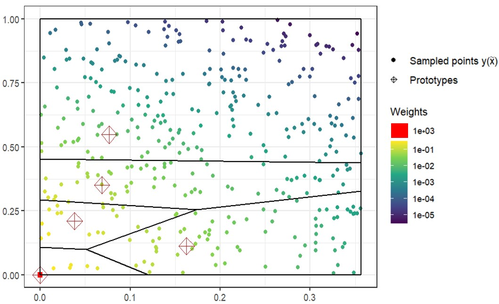

# FunQuant: A R package to perform quantization in the context of rare events and time-consuming simulations

## Summary 

`FunQuant` is a R package that has been specifically developed for carrying out quantization in the context of rare events. While several packages facilitate straightforward implementations of the Lloyd's algorithm, they lack the specific specification of any probabilistic factors, treating all data points equally in terms of weighting. Conversely,  `FunQuant` considers probabilistic weights based on the Importance Sampling formulation to handle the problem of rare event. To be more precise, when $X$ and $Y$ are the random vectors of inputs and outputs of a computer code,  the quantization of $Y(X)$ is performed by estimating the centroid of a given cluster $C$ with the following formula,
$$\frac{\frac{1}{n} \sum_k Y(\tilde X_{k})\mathbb 1_{Y(\tilde X_{k})\in C}\frac{f_{X}(\tilde X_k)}{g(\tilde X_{k})}}{\frac{1}{n} \sum_k \mathbb 1_{Y(\tilde X_k)\in C} \frac{f_{X}(\tilde X_k)}{g(\tilde X_{k})}},$$
where $f_{X}$ is the known density function of the inputs $X$, and $(\tilde X_k)^{n}_{k=1}$ i.i.d. random variables of density function $g$.
Importance Sampling is employed with the aim of reducing the variance of the estimators of the centroids when compared to classical Monte Carlo methods. `FunQuant` provides various approaches for implementing these estimators, depending on the sampling density $g$. The simplest method involves using the same function $g$ for each iteration and every cluster, which is straightforward to work with and still yields significant variance reductions. More advanced implementations enable the adaptation of the sampling density for each cluster at every iteration.

In addition, `FunQuant` is designed to mitigate the computational burden associated with the evaluation of costly data. While users have the flexibility to use their own metamodels to generate additional data, `FunQuant` offers several functions tailored specifically for spatial outputs such as maps. This metamodel relies on Functional Principal Component Analysis and Gaussian Processes, adapted with the `rlibkriging` R package. `FunQuant` assists users in the fine-tuning of its hyperparameters for a quantization task, by providing a set of relevant performance metrics.

## Installation

`FunQuant` can be installed from GitHub, for the very latest version:

``` r
# If not already installed, install package `remotes` with `install.packages("remotes")`
remotes::install_github("charliesire/FunQuant")
```

## Illustrative example

We consider $X = (X_{1},X_{2}) \in \mathbb{R}^2$ a random input of a computer code $H$, with
```math
\left\{
    \begin{array}{ll}
        X_{i} \sim \mathcal{N}_{t}(0,0.25^2, -1, 1), i=1,2 \\
        X_{1} \text{ and }X_{2}\text{ independent}
    \end{array}
\right.
```
where $\mathcal N_{t}(\mu,\sigma^2, a, b)$ is the Gaussian distribution of mean $\mu$, variance $\sigma^2$, truncated between $a$ and $b$. 

The density function of $X$, denoted $f_{X}$, is represented below.


The computer code $H$ is defined with 
```math
H(x) = \left\{
    \begin{array}{ll}
        (0,0) \text{ if } \lvert x_{1}\rvert \leq \alpha \\
        (\lvert x_{1} \rvert - \alpha, \lvert x_{2} \rvert) \text{ otherwise.}
    \end{array}
\right.
```

with $\alpha$ such that $P(H(X) = (0,0)) = 0.99.$

The density $f_{Y}$ of the output $Y = H(X)$ is represented below.


$99\%$ of the probability mass is concentrated at $(0,0)$.

We want to quantize $Y(X)$.

 If the classical Lloyd's algorithm is run with a budget of $1000$ points, it leads to the outcome illustrated below, with only a few sampled points not equal to $(0,0)$. Then, the centroids of the Voronoi cells that do not contain $(0,0)$ are computed with a very small number of points, leading to a very high variance.


The `FunQuant` package allows to adapt the sampling by introducing a random variable $\tilde{X}$ of density $g$, and considering the probabilistic weights of each sample, with are the ratio $\frac{f_{X}}{g}$.

A possible function $g$ is $g(x) = \frac{1}{4}\mathbb{1}_{[-1,1]^2}(x)$, corresponding to a uniform distribution in $[-1,1]^2$.

```r
fX = function(x){
  return(
    dtruncnorm(x = x[1],mean = 0,sd = sd1,a=-1, b=1)*dtruncnorm(x = x[2],mean = 0,sd = sd2,a=-1, b=1))
}

g = function(x){
  if(sum((x>-1)*(x<1))==2){return(1/4)}
  else{return(0)}
}

sample_g = function(n){cbind(runif(n,-1,1), runif(n,-1,1))
}

inputs = sample_g(1000)
outputs = t(apply(inputs,1,Y))
density_ratio = compute_density_ratio(f = fX, 
                                      g = g, 
                                      inputs = inputs)
                                    
res_proto = find_prototypes(data = t(outputs),
                            nb_cells = 5,
                            multistart = 3,
                            density_ratio = density_ratio)
```

The figure below shows the sampled points $Y(\tilde{X}_{k})$, their associated probabilistic weights, and the obtained prototypes. It clearly appears that this sampling brings more information about each Voronoi cells. 




`FunQuant` allows to estimate the standard deviations of the two coordinates of the estimators of the centroids for each Voronoi cell, highlighting the variance reduction obtained with the adapted sampling for the cells that do not contain $(0,0)$.


```r
large_inputs = sample_fX(10^5)
large_outputs = apply(large_inputs,1, Y)
std_centroid_kmeans = std_centroid(
              data = large_outputs, 
              prototypes_list = list(protos_kmeans),
              cells = 1:5, 
              nv = 1000)

std_centroid_kmeans #the cells are ordered by the increasing coordinate x
#of their centroid

# std centroid returns a list of lists: for each tested set of prototypes 
#(here only one set is tested), a list of the estimated standard deviations 
#is provided, each element of this list is associated to a Voronoï cell
```

    ## [[1]]
    ## [[1]][[1]]
    ## [1] 0.0001193543 0.0001012730
    ## 
    ## [[1]][[2]]
    ## [1] 0.04884616 0.07905258
    ## 
    ## [[1]][[3]]
    ## [1] 0.03006552 0.02934998
    ## 
    ## [[1]][[4]]
    ## [1] 0.03214239 0.02801202
    ## 
    ## [[1]][[5]]
    ## [1] 0.06158175 0.12912278


```r

large_inputs_is = sample_g(10^5)
large_outputs_is = apply(large_inputs_is,1, Y)
std_centroid_FunQuant = std_centroid(
              data = large_outputs_is, 
              prototypes_list = list(protos_FunQuant),
              cells = 1:5, 
              nv = 1000)

std_centroid_FunQuant #the cells are ordered by the increasing coordinate x 
#of their centroid

```

    ## [[1]]
    ## [[1]][[1]]
    ## [1] 0.0002358303 0.0002390596
    ## 
    ## [[1]][[2]]
    ## [1] 0.00901367 0.01033904
    ## 
    ## [[1]][[3]]
    ## [1] 0.012857642 0.006439004
    ## 
    ## [[1]][[4]]
    ## [1] 0.00726317 0.01139948
    ## 
    ## [[1]][[5]]
    ## [1] 0.009168924 0.009620646


This example remains basic. Advanced computations of the centroids with tailored density functions $g$ can be performed. `FunQuant` was built to tackle industrial problems with large amounts of data, and comes with additional features such as the possibility to split the computations into different batches. 
