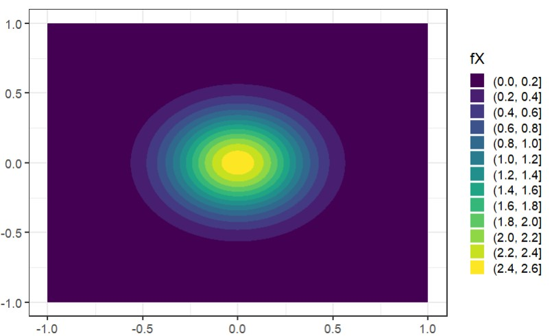

# R Markdown

Quantization helps understand continuous distributions by providing a discrete approximation [@Pages]. Among the widely adopted methods for data quantization is the K-Means algorithm, which partitions the space into Voronoï cells, that can be seen as clusters, and constructs a discrete distribution based on their centroids and probabilistic masses. K-Means investigates the optimal centroids in a minimal expected distance sense [@Bock], but this approach poses significant challenges in scenarios where data evaluation is costly, and relates to a rare event that accumulates the majority of the probabilistic mass in a single cluster. In this context, a metamodel is required and adapted sampling methods are relevant to increase the precision of the computations on the rare clusters.

# Statement of need

FunQuant is an R package that has been specifically developed for carrying out quantization in the realm of rare events. While numerous cutting-edge packages facilitate straightforward implementation of the K-Means algorithm, they lack the incorporation of any probabilistic factors, treating all data points equally in terms of weighting. Conversely, FunQuant employs Importance Sampling estimators [@Paananen] instead of traditional Monte Carlo approach for calculating the centroids. To be more precise, when data $Y$ depends on probabilistic inputs $X$, the centroid of a cluster $C$ is estimated by the following formula: 

$$\frac{\frac{1}{n} \sum^{n}_{k=1} Y(\tilde{X}_{k})\mathbb{1}_{Y(\tilde{X}_{k})\in C}\frac{f_{X}(\tilde{X}^k)}{g(\tilde{X}_{k})}}{\frac{1}{n} \sum^{n}_{k=1} \mathbb{1}_{Y(\tilde{X}^k)\in C} \frac{f_{X}(\tilde{X}_k)}{g(\tilde{X}_{k})}}$$
where $f_{X}$ is the known density function of the inputs $X$, and $(\tilde{X}_k)^{n}_{k=1}$ i.i.d. random variables of density function $g$.
Importance Sampling is employed with the aim of reducing the variance of the estimators of the centroids when compared to classical Monte Carlo methods. FunQuant provides various approaches for implementing these estimators, depending on the sampling density denoted as $g$. The simplest method involves using the same function $g$ for each iteration and every cluster, which is straightforward to work with and still yields significant variance reduction. More advanced implementations enable the adaptation of the sampling density for each cluster at every iteration.

In addition, FunQuant is designed to mitigate the computational burden associated with the evaluation of costly data. While users have the flexibility to utilize their own metamodels to generate additional data, FunQuant offers several functions tailored specifically for a metamodel dedicated to spatial outputs such as maps. This metamodel relies on Functional Principal Component Analysis and Gaussian Processes, based on the work of [@Perrin], adapted with the rlibkriging R package [@rlib]. FunQuant assists in the fine-tuning of its hyperparameters for a quantization task, with different performance metrics involved.

Additional theoretical information can be found in [@sire]. The paper provides a comprehensive exploration of the application of FunQuant to the quantization of flooding maps.

# Illustrative example

We consider a random variable $X = (R cos(\Theta), R sin(\Theta)) \in \mathbb{R}^{2}$ with $R$ and $\Theta$ 2 independant random variables defined by the following probability density functions:
$$\left\{
    \begin{array}{ll}
        f_{R}(r) = 0.99 \delta_{0} + 0.01\times 2(1-r)\\
        f_{\Theta}(\theta) = \frac{1}{2\pi}\mathbb{1}_{[0,2\pi]}(\theta)
    \end{array}
\right.$$

The density function of $X$, denoted $f_{X}$, is represented in the following figure.
<p align="center">
  

$99\%$ of the probability mass is concentrated at $(0,0)$. If a classical 


```{r, include=FALSE}
library(FunQuant)
library(ggplot2)
library(ggvoronoi)
set.seed(10)

```

```{r, include = FALSE}

cdf_r = function(r){2*(r-r^2/2)}
inverse = function(f, lower = 0, upper = 1) {
   return(Vectorize(function (y){as.numeric(uniroot((function (x) f(x) - y), lower = lower, upper = upper)[1])}))
}
inverse_cdf = inverse(cdf_r)
sample_fX = function(n,p = 0.01){
  res = matrix(0, ncol=2, nrow = n)
  u = runif(n)
  vec_normes = runif(sum(u<p))
  vec_r = inverse_cdf(vec_normes)
  angles = runif(sum(u<p), 0, pi/2)
  res[which(u<p),] =  cbind(vec_r*cos(angles), vec_r*sin(angles))
  return(res)
}

fX = function(x){
  r = sqrt(x[1]^2+x[2]^2)
  if(r==0){return(99/100)}
  else if(r<=1){
  return(1/100/(2*pi)*(1-r)*2)
  }
  else(return(0))
}

```

```{r, eval = FALSE, include= FALSE}

design = as.data.frame(expand.grid(x = seq(10^-3,1,l=1000),y= seq(10^-3,1,l=1000)))
design = cbind(design, f = apply(design,1,fX))
design$f=as.numeric(design$f)
design[design$f==0,] = NA

ggplot() + theme_bw() + geom_contour_filled(data=design,aes(x,y,z=f))+  guides(fill=guide_legend(title="fX")) + geom_point(data = as.data.frame(rbind(c(0,0,1))),mapping = aes(x = V1,y=V2, color=V3), color = "red",size = 2, shape=15,show.legend = F) +  theme(legend.key.size = unit(0.4, 'cm'))


```


```{r,include=FALSE}
ff = sample_fX(1000, p=0.01)
res_kmeans = kmeans(ff, centers= 5,nstart = 3)

protos_kmeans = lapply(order(res_kmeans$centers[,1]), function(i){matrix(res_kmeans$centers[i,])})

outline = as.data.frame(rbind(c(0,0), c(0,1), c(1,1), c(1,0)))
df = as.data.frame(res_kmeans$centers)

df_tot = rbind(setNames(as.data.frame(cbind(df, 3,10)), c("V1","V2","V3","V4")), as.data.frame(cbind(ff, 1,1)))
df_tot$V3=as.factor(df_tot$V3)
ggplot(data = df, aes(x = V1,y=V2)) + stat_voronoi(geom = "path", outline = outline)  + theme_bw() + geom_point(data = df_tot, aes(x=V1, y=V2, shape = V3,size = V3,col = V4)) + xlim(0,1) + ylim(0,1)+ coord_fixed() + scale_shape_manual(name = "", 
                     labels = c("Sampled points","Prototypes"), 
                     values = c(16,9)) + scale_color_gradient(low = "black", high = "brown",guide = "none") + scale_size_discrete(guide = "none")

```

```{r}
sample_g = function(n){
  u = runif(n)
  vec_r = c(rep(0, sum(u>0.95)),runif(sum(u<=0.95)))
  angles = runif(n, 0, pi/2)
  return(cbind(vec_r*cos(angles), vec_r*sin(angles)))
}

g = function(x){
    r = sqrt(x[1]^2+x[2]^2)
  if(r==0){return(0.05)}
  else if(r<=1){return(0.95/(2*pi))}
  else(return(0))
}
```

```{r}
inputs = sample_g(1000)
density_ratio = compute_density_ratio(f = fX, g = g, inputs = inputs)
res_proto = find_prototypes(nb_cells = 5,multistart = 3,data = t(inputs),density_ratio = density_ratio)

```

```{r, include = FALSE}
protos = t(Reduce(cbind,res_proto$prototypes))
protos_funquant = lapply(order(protos[,1]), function(i){res_proto$prototypes[[i]]})

df_plot = as.data.frame(cbind(inputs, Weights = density_ratio))

df = as.data.frame(protos)
ggplot(data = df, aes(x = V1,y=V2)) + theme_bw() +geom_point(data = df_plot[df_plot$Weights <= 1,],aes(V1,V2, col = Weights)) +  scale_color_continuous(trans='log10',type = "viridis") + geom_point(data = as.data.frame(rbind(c(0,0,1))),mapping = aes(x = V1,y=V2, color=V3), color = "red",size = 2, shape=15,show.legend = F) + theme_bw()+ xlim(0,1) + ylim(0,1)+ coord_fixed()   + geom_point(shape = 9, colour = "brown", size = 5) + stat_voronoi(geom = "path", outline = outline)
```

```{r}

large_sample = sample_fX(10^5)

std_centroid_kmeans = std_centroid(data = t(large_sample), prototypes_list = list(protos_kmeans), density_ratio = rep(1, nrow(large_sample)), cells = 1:5, nv = 1000)

std_centroid_kmeans #the cells are ordered by increasing "x" coordinate of their centroid

```

```{r}
large_sample_g = sample_g(10^5)

std_centroid_funquant = std_centroid(data = t(large_sample_g), prototypes_list = list(protos_funquant), density_ratio = rep(1, nrow(large_sample)), cells = 1:5, nv = 1000)

std_centroid_funquant #the cells are ordered by increasing "x" coordinate of their centroid
```


```{r,include=FALSE, eval = FALSE}
large_sample = sample_fX(10^6)
error_quanti_1 = quanti_error(data = t(large_sample), prototypes = lapply(1:5, function(i){res_kmeans$centers[i,]}), density_ratio = rep(1, nrow(large_sample)))
error_quanti_2 = quanti_error(data = t(large_sample), prototypes = res_proto$prototypes,density_ratio = rep(1, nrow(large_sample)))
```

# Acknowledgments

This research was conducted with the support of the consortium in
Applied Mathematics CIROQUO, gathering partners in technological and academia in the development of advanced methods for Computer Experiments.

# References


